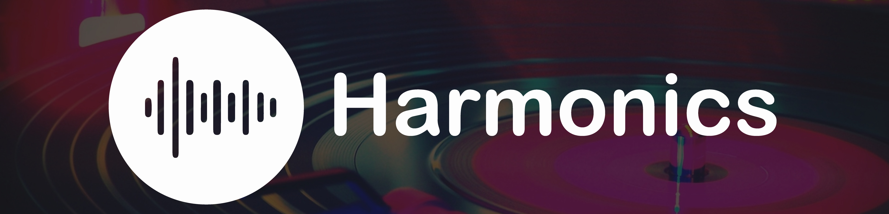

# Harmonics

    <b> Write. Play. Produce </b>

This application was made for a 2020 Hackathon. This application was created by team Harmonics and uses HTML, CSS, PHP, JS as well as Bootstrap.

## Authors

* **Kite** - Technical Lead, Back End Developer, Front End Developer & Server Management
* **Shaan** - Project Management / Scrum Master, Back End Development, Front End Development, Presentation & GitHub Management
* **Alex** - Graphics Design, Presentation, Wire Frame, Screen Design, Mockups
* **Athena** - Graphics Design, Wire Frame, Screen Design, UI, Mockups, Presentation, Project Director
* **Marco** - Lead Front End Developer
* **J.T.** - Front End Development, Project Management, Administration Work

## Acknowledgements

* W3Schools [https://www.w3schools.com/](https://www.w3schools.com/ "https://www.w3schools.com/")
* Courseto [https://coursetro.com/posts/code/130/Learn-Bootstrap-4-Final-in-2018-with-our-Free-Crash-Course](https://coursetro.com/posts/code/130/Learn-Bootstrap-4-Final-in-2018-with-our-Free-Crash-Course)
* CodePen [https://codepen.io/developingidea/pen/meAIn](https://codepen.io/developingidea/pen/meAIn)
* Friend Finder

## License

This project is licensed under the Mozilla Public License 2.0 - see the [LICENSE](http://github.com/ShaanCoding/Harmonics-Syncs/blob/master/LICENSE.md) files for details
